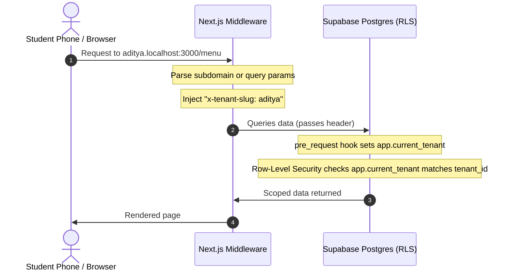

# 🍽️ Tray — Multi-Tenant Food Ordering Engine

[](https://trayy.vercel.app)
[](./LICENSE)

A unified, real-time ordering and kitchen management system. Students order from their phones, kitchens process tickets from a live queue, and admins manage menus and track payouts — all synchronized under a single database with sub-second sync speeds.

---

## 💡 The Vision: Multi-Tenant Architecture

Tray is built from the ground up to solve fragmented, multi-vendor ordering ecosystems. By mapping dynamic subdomains to PostgreSQL Row Level Security (RLS), a single instance of Tray can manage an entire network of canteens, kitchens, and payment streams.



### 🏫 The Campus Edition (Current Focus)
Right now, this codebase is tailored and configured for **Indian college campuses**.
* One college subdomain (e.g., `aditya.trayy.in`) acts as the tenant.
* Multiple distinct canteen blocks, fast food stalls, and juice bars operate as sub-canteens inside that college tenant.
* Students browse, order, pay via UPI, and receive 4-digit pickup codes on their phones.

### 🌐 The Bigger Picture: Infinite Portability
While configured for campuses today, Tray's modular architecture is designed to drop into any multi-merchant environment with zero database migrations or code duplication:
* **🏥 Big Hospitals**: Patient room-service ordering synced to dietary kitchens and ward pantries.
* **🏟️ Sports Stadiums**: Seat-delivery or express-stall pickup maps across dozens of independent food booths.
* **✈️ Airport Cafes / Food Courts**: Terminal-wide ordering, routing checkouts to duty-free vendors or terminal kitchens.
* **🏢 Tech Parks & Malls**: Corporate food court pre-ordering to eliminate lunch-hour queues.

---

## 🚀 Live Demo Portals

Experience the full live synchronized flow with pre-seeded data under the Aditya campus instance:

| Portal / Role | Live URL | Focus & Design |
| :--- | :--- | :--- |
| **📱 Student Ordering** | [trayy.vercel.app/demo/student.html](https://trayy.vercel.app/demo/student.html) | Mobile-first menu browsing, cart curation, UPI payment simulation, & live order tracking. |
| **👨‍🍳 Kitchen Board** | [trayy.vercel.app/demo/kitchen.html](https://trayy.vercel.app/demo/kitchen.html) | Real-time queue tickets, cooking timers, and OTP security verification gate. |
| **📊 Admin Console** | [trayy.vercel.app/demo/admin.html](https://trayy.vercel.app/demo/admin.html) | Live sales KPIs, active orders table, menu editor, and audit logs. |
| **🏫 Campus Portal** | [trayy.vercel.app/college/aditya](https://trayy.vercel.app/college/aditya) | Consolidated reporting and merchant billing metrics. |
| **💡 Interactive Sandbox** | [trayy.vercel.app/demo/index.html](https://trayy.vercel.app/demo/index.html) | Offline-capable high-fidelity HTML/CSS/JS prototype for client demonstrations. |

---

## 📁 Repository Structure

```
Tray/
├── docs/                    # Architecture logs & research
│   ├── adr/                 # Architectural Decision Records (RLS tenancy, OTP pickups, webhook security)
│   └── research/            # Comparative studies (color palettes, GSAP animations, UX stack)
├── public/                  # Static assets & standalone mockups
│   ├── demo/                # Offline interactive HTML portals (simulation engine for quick pitches)
│   └── design-preview/      # Sandbox files for local UI testing
├── scripts/                 # Integrated testing & check utilities
│   ├── test-real-backend.mjs  # Complete backend integration test suite
│   └── demo-verify.mjs      # Linter and structural integrity check for offline demo portals
├── src/                     # Next.js 15 Application Core
│   ├── app/                 # Directory-based app routing
│   │   ├── (public)/        # Landing page, customer login, vendor onboarding wizard
│   │   ├── c/[slug]/        # Canteen-specific context (Dynamic Menu)
│   │   │   ├── kitchen/     # Real-time kitchen staff dashboard
│   │   │   └── admin/       # Visual reporting, audit log, and menu manager
│   │   └── api/             # Webhook endpoints (Razorpay UPI, automatic queue cleanups)
│   ├── components/          # Reusable React components grouped by portal area
│   ├── lib/                 # Core utilities (Supabase hooks, state management, middleware)
│   └── middleware.ts        # Subdomain / path parser mapping requests to PostgreSQL tenants
└── supabase/                # Database migrations & configuration
    └── migrations/          # Chronological schema files (tables, security policies, triggers)
```

---

## 🏗️ Technical Highlights

* **Database-Level Isolation**: Multi-tenancy is enforced directly via PostgreSQL Row Level Security (RLS). Database queries are automatically locked to the active tenant context (`app.current_tenant`), making accidental cross-tenant data leaks impossible.
* **Sub-300ms Realtime Sync**: Active orders feed into an event-sourced stream (`order_events`), allowing the kitchen screen to receive student orders instantly without polling.
* **Resilient Payments**: Razorpay UPI webhook processing is fully idempotent, protected by database-level lock keys to prevent double-charging or duplicate entries.

---

## 🛠️ Local Development & Setup

### Prerequisites
* **Node.js** v22+
* **pnpm** v10+ (standard package manager)
* **Supabase CLI** (for database migrations)

### 1. Installation
Clone the repository and install the dependencies:
```bash
git clone https://github.com/thribhuvan003/Tray.git
cd Tray
pnpm install
```

### 2. Configure Environment
Create a local environment file:
```bash
cp .env.example .env.local
```
Fill in the Supabase API keys in `.env.local` (`NEXT_PUBLIC_SUPABASE_URL`, `NEXT_PUBLIC_SUPABASE_ANON_KEY`, `SUPABASE_SERVICE_ROLE_KEY`). 

---

## 💡 Offline Sandbox Mode vs. Live Production Backend

For easier client demonstrations, local debugging, and review, Tray features a **Dual-Mode Architecture**:

* **Offline Sandbox (Simulation Mode)**: Optional integration APIs (like Razorpay payments or Resend email delivery) can be left unconfigured or blank in your `.env.local`. The application will automatically route requests through sandbox simulations, allowing you to test the checkout flow, view order transitions, and check email notifications offline.
* **Live Production Backend**: When valid credentials and connection keys are supplied, the application connects directly to Supabase with full RLS protection, real Razorpay webhooks, and live SMS/OTP delivery.

---

### 3. Sync Database Schema
Push the PostgreSQL migrations to your local instance:
```bash
supabase db push
```

### 4. Run Dev Server
Launch Next.js:
```bash
pnpm dev
```
Open **[http://aditya.localhost:3000](http://aditya.localhost:3000)** to view the pre-seeded Aditya College Canteen.

#### 🔧 Subdomain Troubleshooting
If your operating system or network configuration does not automatically resolve subdomains on `localhost` (e.g. `aditya.localhost`), you can use the built-in query-parameter override in your browser:
**[http://localhost:3000/?tenant=aditya](http://localhost:3000/?tenant=aditya)**.

---

---

## 🧪 Quality Gate Suite

Before pushing updates, run these quality checks:
```bash
pnpm typecheck          # Verify TypeScript compilation compiles clean
pnpm lint               # Check code linting
pnpm build              # Test Next.js production build output
pnpm demo:verify        # Check offline prototype static page routing
pnpm demo:verify:e2e    # Run Playwright E2E simulation tests
```

---

<div align="center">

Built for modern college campuses &nbsp;·&nbsp; Made with ❤️ in India  
Licensed under the [MIT License](./LICENSE)

</div>
