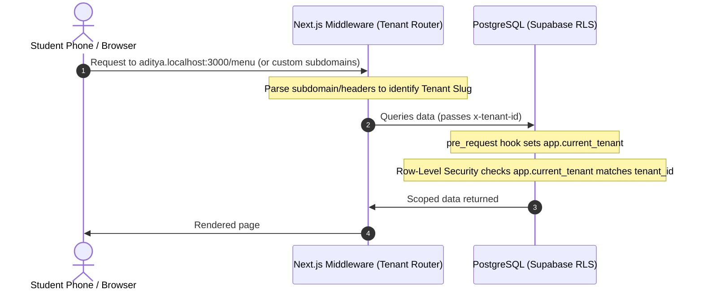

# 🍽️ Tray — Multi-Tenant Campus Canteen Ordering Prototype

[](https://trayy.vercel.app)
[](./LICENSE)

Tray is a multi-tenant ordering and kitchen display management platform designed specifically for university campus vendor coordination. Built with **Next.js 15, PostgreSQL (Supabase RLS), and Razorpay**, it enables students to order from various campus stalls and allows kitchen operators to track preparation queues in real-time.

---

## 🗺️ System Architecture

Tray utilizes a single-instance Postgres database scoped dynamically per tenant using PostgreSQL Row-Level Security (RLS) policies.



---

## 🚀 Key Architectural Pillars

### 🏫 1. Campus Isolation via Row-Level Security (RLS)
* **Unified Domain, Scoped Access:** Multiple independent campus vendors (canteen stalls, juice bars, stationary counters) operate under a single database using tenant partitioning.
* **Deterministic Middleware Routing:** The platform parses custom headers or subdomains dynamically at the edge, binding each request context to the correct vendor namespace via PostgreSQL session settings.

### 💳 2. Automated Financial Routing
* **Razorpay Split Settlements:** Direct onboarding for canteen operators. Transactions are routed dynamically to the vendor's dynamic account identifier (via Razorpay Route) or settle P2P directly to their UPI VPA.
* **Idempotent Webhooks:** Custom webhook handlers feature database transaction locks (`FOR UPDATE`) to completely eliminate double-charging or duplicate order states.

### ⚡ 3. Realtime Kitchen Synchronization
* **Resilient Display Panel:** An append-only realtime queue updates order tickets in the kitchen dashboard in-memory, handling reconnect transitions gracefully on unstable campus networks without causing layout re-renders.

---

## 📁 Repository Structure

```
Tray/
├── docs/                    # Architectural decision records & Ux studies
│   ├── adr/                 # ADRs (RLS tenancy, OTP pickups, webhook security)
│   └── research/            # Comparative studies (color palettes, GSAP animations, UX stack)
├── public/                  # Standalone mockups & prototypes
│   ├── demo/                # Standalone mockups (offline client sales pitches)
│   └── design-preview/      # Sandbox files for local UI testing
├── scripts/                 # Integrated check utilities
│   ├── test-real-backend.mjs  # Complete backend integration test suite
│   └── demo-verify.mjs      # Linter and structural integrity checks
├── src/                     # Next.js 15 Application Core
│   ├── app/                 # App routing
│   │   ├── (public)/        # Landing page, customer login, onboarding wizard
│   │   ├── c/[slug]/        # Canteen-specific context (Dynamic Menu)
│   │   │   ├── kitchen/     # Real-time kitchen staff dashboard
│   │   │   └── admin/       # Visual reporting, audit log, and menu manager
│   │   └── api/             # Webhook endpoints (Razorpay UPI, automatic queue cleanups)
│   ├── components/          # Reusable React components grouped by portal area
│   ├── lib/                 # Core utilities (Supabase hooks, state management, middleware)
│   └── middleware.ts        # Subdomain / path parser mapping requests to PostgreSQL tenants
│   └── supabase/            # Database migrations & configuration
│       └── migrations/      # Chronological schema files (tables, security policies, triggers)
```

---

## 🛠️ Local Development & Setup

### Prerequisites
* **Node.js** v22+
* **pnpm** v10+ (standard package manager)
* **Supabase CLI** (for database migrations)

### 1. Installation
Clone the repository and install the dependencies:
```bash
git clone https://github.com/thribhuvan003/Tray.git
cd Tray
pnpm install
```

### 2. Configure Environment
Create a local environment file:
```bash
cp .env.example .env.local
```
Configure your credentials in `.env.local`:
* **Supabase Credentials:** (`NEXT_PUBLIC_SUPABASE_URL`, `NEXT_PUBLIC_SUPABASE_ANON_KEY`, `SUPABASE_SERVICE_ROLE_KEY`)
* **Razorpay Keys:** (`RAZORPAY_KEY_ID`, `RAZORPAY_KEY_SECRET`, `RAZORPAY_WEBHOOK_SECRET`)
* **Upstash QStash Signings:** (`QSTASH_URL`, `QSTASH_TOKEN`, `QSTASH_CURRENT_SIGNING_KEY`, `QSTASH_NEXT_SIGNING_KEY`)

### 3. Sync Database Schema
Push the PostgreSQL migrations to your local instance:
```bash
supabase db push
```

### 4. Run Dev Server
Launch the Next.js local environment:
```bash
pnpm dev
```
Open **[http://aditya.localhost:3000](http://aditya.localhost:3000)** to view the pre-seeded Aditya College Canteen.
*(If your OS doesn't support local subdomains, use the built-in override: **[http://localhost:3000/?tenant=aditya](http://localhost:3000/?tenant=aditya)**).*

---

## 🧪 Quality Gate Suite
We enforce strict pipeline testing before staging code:
```bash
pnpm typecheck          # Verify TypeScript compilation compiles clean
pnpm lint               # Check code linting
pnpm build              # Test Next.js production build output
pnpm demo:verify        # Check offline prototype static page routing
pnpm demo:verify:e2e    # Run Playwright E2E simulation tests
```

---

<div align="center">

**Tray Campus Edition** &nbsp;·&nbsp; Engineered for Infinite Portability &nbsp;·&nbsp; Made with ❤️ in India  
Licensed under the [MIT License](./LICENSE)

</div>
