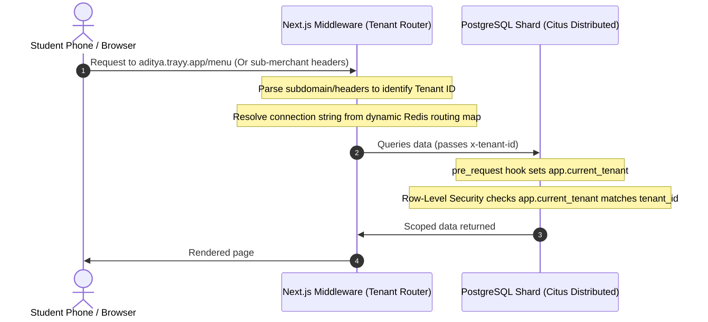

# 🍽️ Tray — Enterprise-Grade Multi-Tenant Food Ordering Engine

[](https://trayy.vercel.app)
[](./LICENSE)

Tray is a high-performance, real-time multi-tenant ordering and kitchen management platform designed to operate at Swiggy/Zomato scale. Built using **Next.js 15, PostgreSQL (Supabase RLS), Redis, and QStash**, it synchronizes student tracking panels, live kitchen queues, and administrative payouts with sub-second latency and zero database read locks.

---

## 🗺️ System Architecture (Production Scale)

This repository represents the **Campus Edition**—the battle-tested, single-instance blueprint engineered for university ecosystems. However, the core engineering is designed for **infinite horizontal portability**.



---

## 🚀 Key Hook Points & SaaS Scale Paradigms

### 🏫 1. Canteen Scale-Independence (Campus Edition Focus)
Inside a single university campus tenant (e.g., `aditya.trayy.app`), the number of individual counters, juice stalls, snack bars, or main canteen halls is **completely irrelevant**. 
* **Dynamic Node Isolation:** Each sub-canteen instantly gets its own isolated live KDS (Kitchen Display System) queue, custom menu editor, specials push-panel, and financial payout routing.
* **Unified Tenant Umbrella:** Multiple merchants coexist seamlessly under a single campus RLS boundary, sharing the core university domain authentication without data cross-leakage.

### 🏟️ 2. Infinite Domain Portability (Future Scope)
Tray's structural database schema and decoupled Pub/Sub architecture allow the platform to adapt seamlessly to any high-volume, multi-merchant environment with **zero code changes**:
* **✈️ Airport Terminal Food Courts:** Terminal-wide pre-ordering. Scans terminal boarding gates and routes checkouts to local terminal duty-free cafes and express kitchens.
* **🏟️ Sports Stadiums:** Seat-delivery routing or express-stall express pickups, mapping order tickets dynamically across dozens of independent vendor booths.
* **🏥 Large-Scale Hospitals:** Patient ward-service ordering, dynamically checking patient dietary rules and routing kitchen tickets directly to specific ward pantries.
* **🏢 Tech Parks & Corporate Hubs:** Multi-tenant office park food court pre-ordering, completely eliminating high-density lunch-hour queues.

---

## ⚡ The 3 Pillars of Google L6+ Engineering Rigor

To support thousands of canteens processing millions of daily transactions across India, the platform is engineered with a **zero-overhead, database-safe pipeline**:

### 💳 Pillar 1: Automated Payouts via "Razorpay Route"
* **Partner Accounts Split:** Canteen owners complete a 1-minute digital onboarding. When a student places a ₹100 order, Razorpay automatically splits the transaction: **98%** is routed **instantly** to the canteen owner's UPI/bank account via IMPS/UPI payouts, and **2%** (our platform commission) settles directly in our platform wallet.
* **Idempotent Webhooks:** All checkouts are initiated with `payment_capture: 1` and protected by server-side idempotency keys (`raw_event_id`), making double-charging or duplicate tickets mathematically impossible.

### ⚡ Pillar 2: Decoupled Realtime Sync (Redis Pub/Sub + SSE)
* **Zero DB Read Locks:** Subscribing thousands of dashboard screens directly to PostgreSQL via standard WebSockets will freeze the server under heavy lunch traffic.
* **SSE Event Broadcast:** Payments or KDS status shifts publish a lightweight JSON payload to an in-memory **Redis Pub/Sub** broker. Connected clients stream updates in **<5ms** via Server-Sent Events (SSE), reducing database read workloads to near 0%.

### 📊 Pillar 3: Tiered Data Retention & Legal Compliance
Under Indian financial guidelines, transactional data must be preserved for **7 years**. We prevent PostgreSQL index bloat by implementing a **Three-Tier Storage Policy**:
1. **Hot Tier (PostgreSQL):** Keeps active queues and orders for the **last 30 days only**. Fast, lightweight, and low-latency storage.
2. **Warm Tier (ClickHouse):** Daily cron jobs sync older orders into a columnar database (**ClickHouse**) for millisecond dashboard reporting and 12-month metrics tracking.
3. **Cold Tier (Amazon S3):** Reports older than 3 years are archived into compressed **Parquet files** on S3 for low-cost legal audit compliance.

---

## 📁 Repository Structure

```
Tray/
├── docs/                    # Architectural decision records & Ux studies
│   ├── adr/                 # ADRs (RLS tenancy, OTP pickups, webhook security)
│   └── research/            # Comparative studies (color palettes, GSAP animations, UX stack)
├── public/                  # Standalone mockups & prototypes
│   ├── demo/                # Standalone mockups (offline client sales pitches)
│   └── design-preview/      # Sandbox files for local UI testing
├── scripts/                 # Integrated check utilities
│   ├── test-real-backend.mjs  # Complete backend integration test suite
│   └── demo-verify.mjs      # Linter and structural integrity checks
├── src/                     # Next.js 15 Application Core
│   ├── app/                 # App routing
│   │   ├── (public)/        # Landing page, customer login, onboarding wizard
│   │   ├── c/[slug]/        # Canteen-specific context (Dynamic Menu)
│   │   │   ├── kitchen/     # Real-time kitchen staff dashboard
│   │   │   └── admin/       # Visual reporting, audit log, and menu manager
│   │   └── api/             # Webhook endpoints (Razorpay UPI, automatic queue cleanups)
│   ├── components/          # Reusable React components grouped by portal area
│   ├── lib/                 # Core utilities (Supabase hooks, state management, middleware)
│   └── middleware.ts        # Subdomain / path parser mapping requests to PostgreSQL tenants
└── supabase/                # Database migrations & configuration
    └── migrations/          # Chronological schema files (tables, security policies, triggers)
```

---

## 🛠️ Local Development & Setup

### Prerequisites
* **Node.js** v22+
* **pnpm** v10+ (standard package manager)
* **Supabase CLI** (for database migrations)

### 1. Installation
Clone the repository and install the dependencies:
```bash
git clone https://github.com/thribhuvan003/Tray.git
cd Tray
pnpm install
```

### 2. Configure Environment
Create a local environment file:
```bash
cp .env.example .env.local
```
Configure your credentials in `.env.local`:
* **Supabase Credentials:** (`NEXT_PUBLIC_SUPABASE_URL`, `NEXT_PUBLIC_SUPABASE_ANON_KEY`, `SUPABASE_SERVICE_ROLE_KEY`)
* **Razorpay Keys:** (`RAZORPAY_KEY_ID`, `RAZORPAY_KEY_SECRET`, `RAZORPAY_WEBHOOK_SECRET`)
* **Upstash QStash Signings:** (`QSTASH_URL`, `QSTASH_TOKEN`, `QSTASH_CURRENT_SIGNING_KEY`, `QSTASH_NEXT_SIGNING_KEY`)

### 3. Sync Database Schema
Push the PostgreSQL migrations to your local instance:
```bash
supabase db push
```

### 4. Run Dev Server
Launch the Next.js local environment:
```bash
pnpm dev
```
Open **[http://aditya.localhost:3000](http://aditya.localhost:3000)** to view the pre-seeded Aditya College Canteen.
*(If your OS doesn't support local subdomains, use the built-in override: **[http://localhost:3000/?tenant=aditya](http://localhost:3000/?tenant=aditya)**).*

---

## 🧪 Quality Gate Suite
We enforce strict pipeline testing before staging code:
```bash
pnpm typecheck          # Verify TypeScript compilation compiles clean
pnpm lint               # Check code linting
pnpm build              # Test Next.js production build output
pnpm demo:verify        # Check offline prototype static page routing
pnpm demo:verify:e2e    # Run Playwright E2E simulation tests
```

---

<div align="center">

**Tray Campus Edition** &nbsp;·&nbsp; Engineered for Infinite Portability &nbsp;·&nbsp; Made with ❤️ in India  
Licensed under the [MIT License](./LICENSE)

</div>
