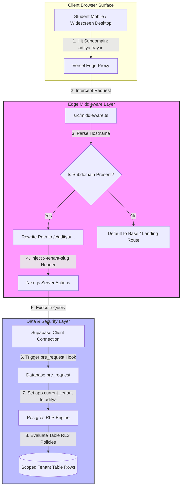
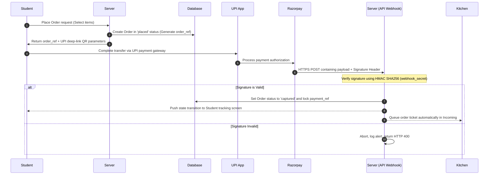

# 📖 Tray — Developer Guide & Architecture Manual
> **Author:** Senior Systems Engineer  
> **Repository Quality Standards:** Google & Apple Production Codebase Guidelines.

Welcome to the definitive system architecture and development manual for **Tray**. This manual provides a deep-dive analysis of the codebase design patterns, production scaling, security models, and local setup configurations.

---

## 🗺️ 1. File Structure & Repository Taxonomy

Tray is engineered using a decoupled, **Layered Service-Oriented Architecture** with strict Separation of Concerns (SoC) boundaries.

### 📂 Structural Blueprint

```
Tray/
├── .github/                   # CI/CD Workflows & GitHub Configurations
│   ├── ISSUE_TEMPLATE/        # Standardized bug and feature reporting models
│   ├── workflows/             # Integration workflows (lint, typecheck, build gates)
│   └── CODEOWNERS             # Root ownership mapping for review processes
├── docs/                      # Repository system specifications & ADRs
│   ├── adr/                   # Architecture Decision Records (RLS, webhook idempotency)
│   ├── research/              # Dynamic styling libraries, GSAP, and comparative UX analyses
│   ├── DEMO-SPEC.md           # Product feature verification checkpoints
│   └── DEVELOPER-GUIDE.md     # [This Document] Canonical system manual
├── public/                    # Production assets & static simulation engine
│   └── demo/                  # Offline-capable high-fidelity customer prototypes
├── scripts/                   # System automation, E2E browser testers, & diagnostic suites
│   ├── e2e-testcanteen.mjs    # Complete user payment and tracking simulation
│   └── demo-verify.mjs        # structural linter verifying static router links
├── src/                       # Next.js 15 Application Core
│   ├── app/                   # File-based directory routing and Actions Core
│   │   ├── (admin)/           # Owner dashboards, menu curations, and settings
│   │   ├── (kitchen)/         # Live queue and specials managers for staff
│   │   ├── (student)/         # Mobile-responsive student menu boards, checkout, and tracking
│   │   ├── (public)/          # Landing marketing, logins, and onboarding wizards
│   │   ├── auth/              # Google OAuth callbacks & Magic Link verification routes
│   │   └── middleware.ts      # Edge-level tenant resolver & header injection
│   ├── components/            # Reusable UI component modules grouped by workspace
│   └── lib/                   # Database interfaces, auth helpers, and state models
└── supabase/                  # Database management schema configurations
    ├── migrations/            # Chronological PostgreSQL migrations
    └── setup.sql              # Core database schema structure definition
```

---

## 🛰️ 2. Core Architectural Subsystems

The application handles extreme scale and isolation by dividing operations into three primary boundaries: the Edge Routing Boundary, the Postgres RLS Tenancy Boundary, and the Real-time Sync Boundary.



### 🌍 A. Multi-Tenant Edge Subdomain Routing
Multi-tenancy is handled at the network boundary.
1.  Next.js `middleware.ts` intercepts incoming HTTP requests at the edge.
2.  The middleware extracts the hostname from headers (e.g., `aditya.tray.in` or `localhost:3000`).
3.  If a subdomain exists and is not a reserved name (e.g., `www`, `api`), the path is dynamically rewritten internally to route to the canteen folder context: `/c/[slug]/`.
4.  The middleware injects a custom HTTP header `x-tenant-slug` containing the active tenant name into the server thread.

### 🛡️ B. Database-Level Isolation (PostgreSQL RLS)
Data separation is enforced at the database layer using PostgreSQL **Row Level Security (RLS)**:
1.  Every table is configured with a `tenant_id` column linking back to the `canteen_tenants` directory.
2.  A Supabase database function acting as a `pre_request` hook captures the edge injected header and maps it to a database session variable:
    ```sql
    SET LOCAL app.current_tenant = current_setting('request.headers', true)::json->>'x-tenant-slug';
    ```
3.  Table RLS policies evaluate row accesses by verifying that row `tenant_id` matches this active session parameter, completely isolating data queries at the kernel level:
    ```sql
    CREATE POLICY tenant_isolation_policy ON menu_items
      FOR ALL USING (tenant_id = (SELECT id FROM canteen_tenants WHERE slug = current_setting('app.current_tenant', true)));
    ```

### ⚡ C. Sub-300ms Real-Time Event Sync
Order transitions must propagate instantly without dragging server resources:
1.  **Append-Only Events:** State transitions are written to an append-only database log (`order_events`).
2.  **WebSockets Stream:** Clients subscribe to live table mutations using Supabase Real-time WebSocket handlers.
3.  **Background Fail-Safe Polling:** Client portals include an active background polling loop running at 10-second intervals to verify synchronization integrity during transient network dropouts.

---

## 🔒 3. Payment Processing & Cryptographic Webhooks

Tray implements a highly secure payment verification flow backed by the **Razorpay UPI API**:



### 🔑 A. Idempotency Protections
Network delays can cause webhook events to fire repeatedly. To prevent duplicate orders or multiple checkout operations for a single transaction, the order capture endpoint maps transaction references to a database unique constraint:
1.  The `payments` table defines a unique constraint on the `payment_ref` key (e.g., Razorpay payment transaction UUID).
2.  Attempts to re-capture or process a duplicate webhook payload trigger a Postgres unique violation block, silently completing successfully without duplicate order placements.

### 🛡️ B. Webhook Signature Validation
To prevent spoofing attacks, all webhook POST payloads must be verified against their cryptographic headers:
```typescript
import crypto from "crypto";

const expectedSignature = req.headers["x-razorpay-signature"];
const generatedSignature = crypto
  .createHmac("sha256", process.env.RAZORPAY_WEBHOOK_SECRET!)
  .update(JSON.stringify(req.body))
  .digest("hex");

if (expectedSignature !== generatedSignature) {
  throw new Error("Cryptographic Signature Verification Failed");
}
```

---

## 🚀 4. Infrastructure & Production Deployments

### 🗄️ A. Supabase (Database & Auth Provisioning)
1.  **Schema Provisioning:** Execute migrations on your target instance using the Supabase CLI:
    ```bash
    supabase db push --project-ref <your-supabase-project-id>
    ```
2.  **OAuth Server Setup:** Enable Google Sign-In in **Authentication** > **Providers** > **Google**. Specify your Client ID and Client Secret from your Google Cloud Console.
3.  **Cross-Account Linking:** Toggle **"Link accounts with same email"** to **ON** inside Supabase Auth Settings. This binds Google auth credentials and email registrations under a single user identity.
4.  **Callback Whitelists:** Whitelist the callback route: `https://<yourdomain>/auth/callback`.

### 🌐 B. Vercel (Edge Deployments & Wildcards)
1.  **Environment Sync:** Create your project and declare variables mimicking `.env.example`.
2.  **Wildcard Domains:** Go to Vercel Project **Settings** > **Domains** and add your custom wildcard root domain `*.yourdomain.com`.
3.  **Referrer Policy Safeguard:** Server Actions must explicitly bind parameters (such as `tenantSlug`) rather than depending on HTTP referrers, as strict browsers (iOS Safari, Brave) strip URLs down to host origins.

---

## 🛠️ 5. Local Setup & Troubleshooting Guide

### 📋 Prerequisites
*   Node.js v22+
*   pnpm v10+ (standard package manager)
*   Supabase CLI (optional, database schema pushes)

### 🏃 Quick Start
```bash
# 1. Clone the codebase
git clone https://github.com/thribhuvan003/Tray.git
cd Tray

# 2. Install dependencies
pnpm install

# 3. Create env file and input configuration keys
cp .env.example .env.local

# 4. Start Next.js development server
pnpm dev
```

### 🔧 Local Subdomain Configurations
By default, Next.js routes to the `localhost:3000` main landing page. To simulate subdomains locally:
*   **Query Param Fallback:** Use the built-in URL override to simulate tenant contexts immediately:
    **`http://localhost:3000/?tenant=aditya`**
*   **Hosts File Configuration (Recommended):** Add aliases to your OS `/etc/hosts` (Unix) or `C:\Windows\System32\drivers\etc\hosts` (Windows) file:
    ```
    127.0.0.1   aditya.localhost
    127.0.0.1   so-so.localhost
    ```
    You can then access canteens dynamically in your browser:
    **`http://aditya.localhost:3000`**
