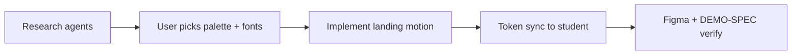

# Landing team brief

Single coordination doc for the F1 landing refresh. Merges parallel research intent with **what is already shipped** in the repo (2026-05-20).

| Related doc | Purpose |
|-------------|---------|
| [senior-dev-animation-decision.md](research/senior-dev-animation-decision.md) | Animation stack verdict + per-section tool map |
| [landing-design-options.md](landing-design-options.md) | User picks: palette A–E, fonts 1–4, motion intensity |
| [design-system-figma.md](design-system-figma.md) | Token + component map for Figma |
| [DEMO-SPEC.md](DEMO-SPEC.md) | Demo QA bar; reduced-motion requirement |
| [PARALLEL-WORK.md](PARALLEL-WORK.md) | Cross-chat lanes; kitchen do-not-touch |

Research pack (merged into this brief):

| File | Contents |
|------|----------|
| [research/senior-dev-animation-decision.md](research/senior-dev-animation-decision.md) | Verdict, load budget, implementation rules |
| [research/animation-stack-comparison.md](research/animation-stack-comparison.md) | GSAP vs Motion vs CSS tiers + measured KB |
| [research/motion-patterns.md](research/motion-patterns.md) | Award-site pattern catalog + Tray section map |
| [research/motion-code-sources.md](research/motion-code-sources.md) | Copy-paste reference links |
| [research/typography-color-research.md](research/typography-color-research.md) | Extended palette/font research (if diverges from design-options, **design-options wins** for user pick) |

---

## 1. Animation stack decision

**Verdict:** **Balanced hybrid** — CSS for static polish; **GSAP + ScrollTrigger** (dynamic import) for hero + scroll choreography; **no** ScrollSmoother; **framer-motion** stays on admin product routes only.

Summary from [senior-dev-animation-decision.md](research/senior-dev-animation-decision.md) (details + dissent in that doc):

- **Hybrid:** GSAP+ScrollTrigger owns scroll choreography in `landing-motion.tsx` (dynamic import); CSS for ticker/live dot/grain; **no** `framer-motion` on landing (admin charts only).
- **Budget:** ≤55 KB gzip deferred animation chunk; **0 KB** on LCP critical path — hero must pass `markReady()` within 700ms or on `prefers-reduced-motion`.
- **Measured:** ~115 KB minified GSAP+ScrollTrigger in `node_modules` → ~34 KB gzip typical ([animation-stack-comparison.md](research/animation-stack-comparison.md)).
- **Trim path:** Gate scrub triggers on mobile; move button scale / portal tilt to CSS before rewriting scroll reveals.

---

## 2. Optimized motion shortlist

Top **six** effects to implement or preserve (name → library → load → section). Others are CSS-only or defer.

| # | Effect | Library | Load cost | Section |
|---|--------|---------|-----------|---------|
| 1 | **Hero word stagger + stat count-up** | GSAP timeline | Medium (part of GSAP chunk) | Hero |
| 2 | **Scroll progress bar scrub** | GSAP ScrollTrigger | Low ongoing | Global nav |
| 3 | **Portal deck fan-in** (`rotateX` rise, stagger) | GSAP + ScrollTrigger | Medium | `#system` |
| 4 | **Sync diagram lanes** (panel scale + nodes L/R + arrows) | GSAP + ScrollTrigger | Medium | `#sync` |
| 5 | **Pull quote blur dissolve** | GSAP (filter) | Medium–high (use once) | `.tl-pull` |
| 6 | **Portal chrome 3D tilt** | GSAP quickTo on mousemove | Low per interaction | `#system` portals |

**CSS-only (keep out of GSAP):** nav sticky blur, button color hovers, card lift shadows, ticker marquee, live dot pulse, ambient orb gradients.

**Shipped but not in top 6** (medium intensity — tune after user picks motion level): flow numeral spin, stack center pop, closing CTA cascade, line-leave chip spring, global orb parallax scrub.

---

## 3. User selection still required

Blocking visual refresh until the product owner chooses:

| Decision | Options | Doc |
|----------|---------|-----|
| Color palette | **A–E** | [landing-design-options.md](landing-design-options.md) §2 |
| Font pairing | **1–4** | [landing-design-options.md](landing-design-options.md) §3 |
| Motion intensity | subtle / medium / bold | [landing-design-options.md](landing-design-options.md) §4 |

**Reply template:**

```text
I pick palette A + font 1 + motion medium
```

**Visual picker:** http://localhost:3000/design-preview/palettes.html (`public/design-preview/palettes.html`)

**Default recommendation (if no change):** Palette **A** + font **1** + motion **medium** — matches production Pre-Monsoon Dusk.

---

## 4. Team workflow



| Step | Owner | Output |
|------|--------|--------|
| 1. Research | Parallel agents | `docs/research/*`, design-options content |
| 2. User picks | Product owner | Palette A–E, font 1–4, motion level |
| 3. Implement landing motion | `landing-next` lane | `landing-page.tsx`, `landing-motion.tsx`; no kitchen.html |
| 4. Token sync | `demo-student` / app theme | Student demo + app CSS vars from landing pick |
| 5. Verify | QA | `npm run build`, `npm run demo:verify`, reduced-motion manual check |

**Lane locks:** Kitchen static demo untouched. Landing GSAP scoped to `.tray-landing` only.

---

## 5. Anti-patterns

Do **not** do these on the Tray landing sprint:

| Anti-pattern | Why |
|--------------|-----|
| **Full GSAP on every element** | Inflates ScrollTrigger count, main-thread work, and debugging cost; duplicates CSS hovers |
| **ScrollSmoother on mobile** | Breaks native scroll, hurts accessibility, heavy bundle; use native scroll + selective triggers |
| **GSAP before first paint without fallback** | Caused invisible hero (fixed: `tl-anim-init` + 700ms `markReady`) |
| **SplitText / ScrambleText on body copy** | SEO, CLS, and readability risk on marketing copy |
| **Pinning multiple full-viewport sections** | Mobile address-bar jank; conflicts with iframe portal previews |
| **Animating layout properties** (`width`, `top`, `margin`) | Prefer `transform` + `opacity` (+ `filter` sparingly) |
| **framer-motion + GSAP on same node** | Double transforms; pick one driver per element |
| **Loading GSAP on student/kitchen/admin demos** | Demos are static HTML; keep motion isolated to Next landing |
| **Merging landing tokens into `globals.css` without ADR** | Product app theme coupling (see design-system-figma.md) |
| **Motion required to understand CTA** | Violates DEMO-SPEC reduced-motion bar |

---

## Implementation checklist (post-pick)

- [ ] Apply palette + fonts to `SCOPED_CSS` in `landing-page.tsx`
- [ ] Adjust motion intensity (disable or soften effects below top 6 if **subtle**)
- [ ] Update `docs/design-system-figma.md` variable table
- [ ] Student demo token pass (`public/demo/student.html` or Next student shell)
- [ ] Append session to `docs/PARALLEL-WORK.md`
- [ ] `npm run typecheck` && `npm run build`
