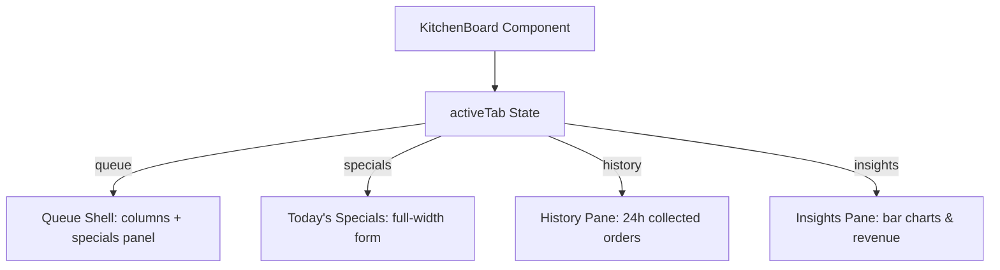

# Kitchen Portal Refactor & Real-Time Sync Design

This design document outlines the implementation plan to refactor the Next.js kitchen queue portal into a fully interactive, single-page application matching the premium look, tabs, and aesthetics of the static demo (`public/demo/kitchen.html`), powered by real-time Supabase operations and a 10-second fail-safe sync loop.

## Objectives
1. **Full Feature Parity with Demo:** Support sidebar navigation tabs (`Live queue`, `Today's specials`, `History`, `Insights`) within a single-page React app state.
2. **Real-time Specials Management:** Pushing a special from the kitchen portal adds a real live item in the Specials category in Supabase, making it visible to students immediately.
3. **Walk-In Orders:** Staff can trigger cash/counter walk-in orders which are inserted directly as `placed` in Supabase with random menu items.
4. **10-Second State Sync:** Add an explicit 10-second data polling interval to keep all metrics, queues, and ticker status perfectly aligned.
5. **Insights & History Tabs:** Implement the completed order history table and top-selling items metrics with beautiful styled visuals.

---

## Architecture & Data Flow

### 1. Unified Client-Side State


### 2. Database Action Integration
*   **Walk-in Order:**
    *   Walk-in orders bypass the Razorpay gate.
    *   A server action `createWalkInOrderAction` is registered. It selects 1-3 active menu items randomly (or allows staff choice) and inserts the order directly in `placed` status.
*   **Live Specials:**
    *   A server action `createSpecialMenuItem` is registered.
    *   It checks for a `Specials` category. If none exists, it creates it under the current tenant.
    *   It inserts the new menu item into the Specials category as `live` and `in_stock`.
    *   An `emitOrderEvent` triggers a realtime refresh across all student portals.

### 3. Fail-Safe 10-Second Sync Loop
*   A `setInterval` runs every 10,000ms. If the tab is visible, it triggers the full state refetch of active orders, items, and marquee items.
*   This acts alongside the append-only WebSocket event subscriber to ensure 100% data fidelity on flaky campus networks.

---

## Proposed Technical Changes

### Server Actions (`src/app/(kitchen)/_actions.ts`)
*   Add `createWalkInOrderAction(items: { menuItemId: string; qty: number }[])` to place cash orders immediately.
*   Add `createSpecialMenuItem(form: { name: string; description: string; price_paise: number; prep_target_seconds: number; diet: "veg" | "nonveg" | "egg" })` to insert specials.

### React Components (`src/components/portal-kitchen/board.tsx`)
*   Replace internal structural layout with a tabbed viewport: `activeTab` controls what's rendered.
*   Include the sidebar navigation layout containing exact demo items (Live queue, Today's specials, History, Insights).
*   Add a 10s sync timer alongside WebSockets:
    ```typescript
    const pollId = setInterval(() => {
      if (document.visibilityState === "visible") void refresh();
    }, 10_000);
    ```
*   Implement the Specials Panel, History view, and Insights view matching `.hist-table` and `.ins-list` CSS styles exactly.

---

## Verification & Testing
*   **Local UI Verification:** Open kitchen portal, add walk-in order, check that card appears instantly and advances.
*   **Database Sync:** Add a live special, verify it instantly appears on the Student menu portal category.
*   **Static Type Checking:** Run `pnpm typecheck` to ensure zero compilation or import issues.
